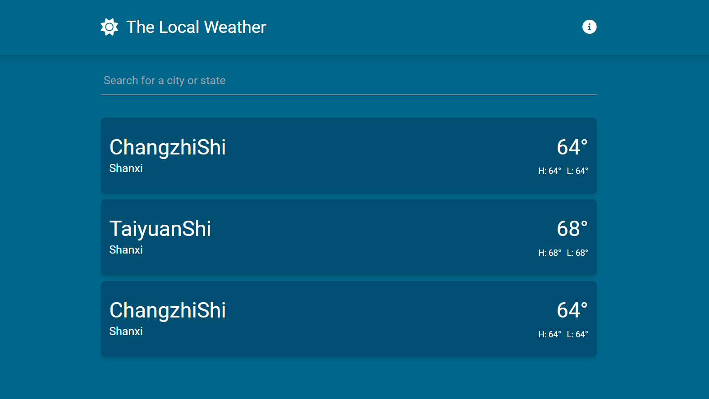
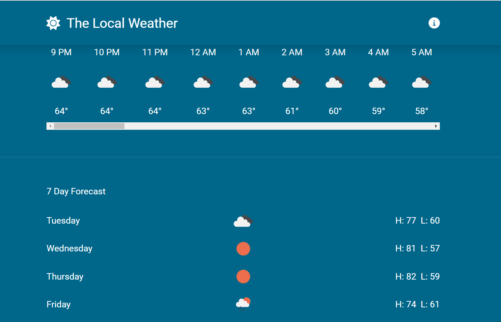

# weatherCheck

简单的调用 API 然后展示天气。

## 页面展示



## 运行项目
首先安装对应的依赖
```sh
npm install
```

### Compile and Hot-Reload for Development

```sh
npm run dev
```

### Compile and Minify for Production

```sh
npm run build
```
